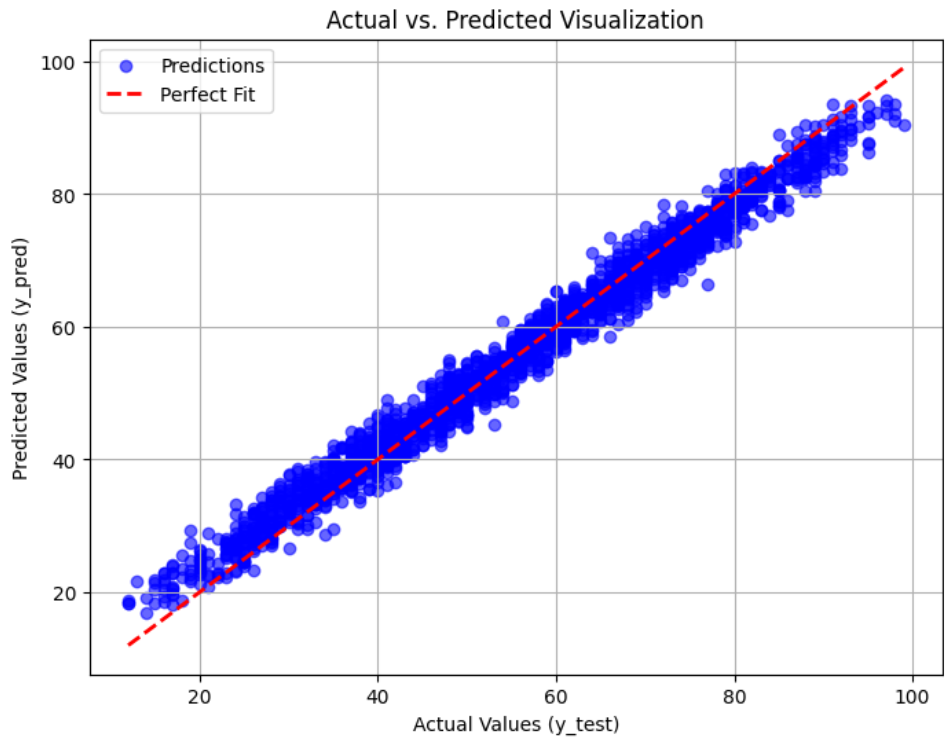

# 📚 Student Performance Prediction using Multiple Linear Regression

## 📖 Overview

This project predicts a student's final performance score using **Multiple Linear Regression**. The objective is to understand how multiple independent variables contribute to predicting a continuous target variable while learning the complete machine learning workflow.

The project includes:

- Data preprocessing
- Feature engineering
- Handling categorical variables
- Model training
- Model evaluation
- Prediction visualization

---

## 🎯 Objective

To build a machine learning model capable of predicting a student's final score based on various academic and personal attributes.

---

## 🛠️ Technologies Used

- Python
- Pandas
- NumPy
- Matplotlib
- Scikit-learn

---

## 📂 Dataset

The dataset contains information related to student performance, including academic, demographic, and behavioral features.

Examples of features include:

- Study time
- Attendance
- Previous grades
- Age
- Gender
- Family background
- Internet access
- Weekend activities
- And several other student-related attributes.

The target variable is:

- **Final Score**

---

## ⚙️ Data Preprocessing

The following preprocessing steps were performed:

- Removed unnecessary columns (if applicable)
- Checked for missing values
- Converted binary categorical variables into numerical values
  - Male/Female
  - Yes/No
- Applied One-Hot Encoding for categorical features such as regions or other multi-class variables
- Split the dataset into training and testing sets

---

## 📈 Model

The model used is:

**Multiple Linear Regression**

The model learns the relationship between several independent variables and one continuous target variable.

---

## 📊 Results

### Model Performance

| Metric | Value |
|---------|--------|
| R² Score | **0.97** |

An R² score of **0.97** indicates that the model explains approximately **97% of the variance** in the students' final scores.

---

## 📉 Prediction Visualization

The graph below compares the actual student scores with the predicted scores.

- Blue points represent model predictions.
- The red dashed line represents a perfect prediction.

As seen below, most predictions lie very close to the ideal line, demonstrating strong predictive performance.



---

## Sample Predictions

| Actual Score | Predicted Score |
|--------------|-----------------|
| 28           | 30.22           |
| 35           | 34.85           |
| 63           | 59.59           |
| 71           | 71.22           |
| 78           | 76.76           |

The predictions closely match the true values with only small prediction errors.

---

## 📚 What I Learned

Through this project, I learned:

- Multiple Linear Regression
- Data preprocessing
- Feature encoding
- One-Hot Encoding
- Train-Test Split
- Model evaluation
- R² Score interpretation
- Data visualization
- Predicting continuous variables using machine learning

---

## 🚀 Future Improvements

Possible improvements include:

- Feature selection
- Cross-validation
- Polynomial Regression
- Ridge Regression
- Lasso Regression
- Random Forest Regressor
- Gradient Boosting
- Hyperparameter tuning

---

## ▶️ How to Run

Clone the repository

```bash
git clone https://github.com/samyakbhattarai/Student_Performance_MLR.git
```

Install the dependencies

```bash
pip install pandas numpy matplotlib scikit-learn
```

Run the notebook or Python script.


## 📄 License

This project is intended for educational purposes.
